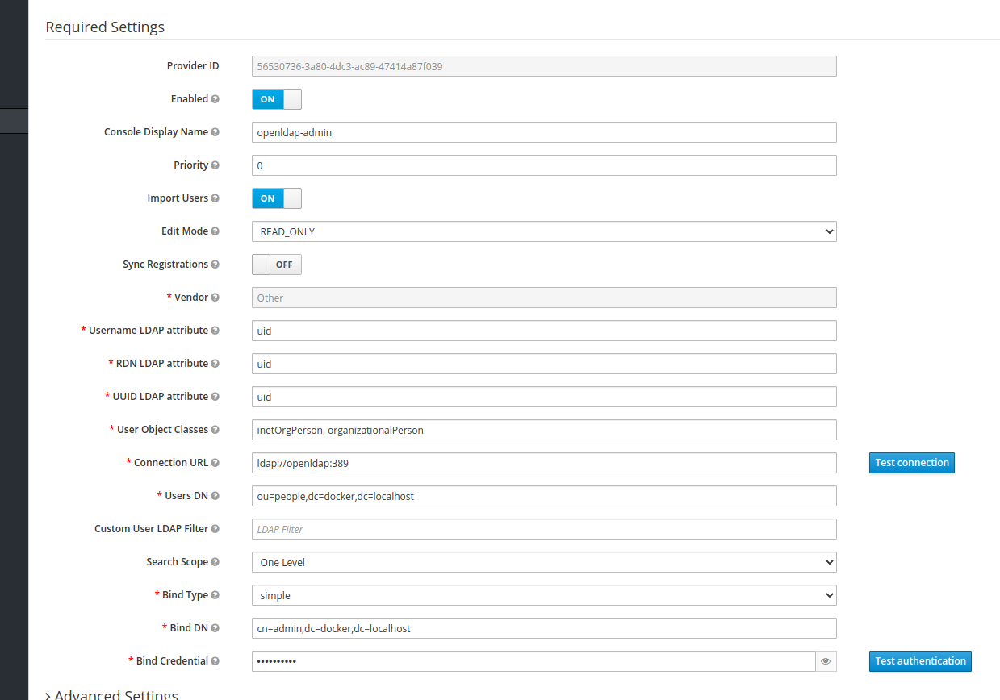

# DevOps Tools

## Helpers

```sh
# Use the following command to generate a hash for the password:
$ docker run --rm httpd:2.4-alpine htpasswd -nbB infra 'infra' | cut -d ":" -f 2
```

## Prepare https localhost

```sh
$ export MKCERT_VERSION=1.4.1
$ sudo wget -O /usr/local/bin/mkcert https://github.com/FiloSottile/mkcert/releases/download/v$MKCERT_VERSION/mkcert-v$MKCERT_VERSION-linux-amd64
$ sudo chmod +x /usr/local/bin/mkcert
$ mkcert mkcert docker.localhost "*.docker.localhost"
```

Then move the two files generated in __devcerts__

## How to use traefik labels

```sh
- traefik.enable=true
- traefik.http.services.NOM-SERVICE.loadbalancer.server.port=8080

- traefik.http.routers.NOM-SERVICE-http.entrypoints=insecure
- traefik.http.routers.NOM-SERVICE-http.rule=Host(`NOM-SERVICE.NDD`)

- traefik.http.middlewares.https-redirect.redirectscheme.scheme=https
- traefik.http.middlewares.https-redirect.redirectscheme.permanent=true
- traefik.http.routers.NOM-SERVICE-http.middlewares=https-redirect@docker

- traefik.http.routers.NOM-SERVICE-https.entrypoints=secure
- traefik.http.routers.NOM-SERVICE-https.rule=Host(`NOM-SERVICE.NDD`)
- traefik.http.routers.NOM-SERVICE-https.tls=true
```

## Start / Stop the stack

To start the infrastructure on localhost:

```sh
$ ./start.sh
```

To stop the infrastructure on localhost:

```sh
$ ./stop.sh
```

To initialize the infrastructure, after starting:

```sh
$ ./initialize.sh
```

### Portainer

https://portainer.docker.localhost

Credentials:
* username: admin
* password: infra

### Keycloak

https://keycloak.docker.localhost

Credentials:
* username: admin
* password: infra



### OpenLDAP

Credentials:
* username: admin
* password: infra

### OpenLDAP WebUI

https://ldap-manager.docker.localhost

Firt setup go to: https://ldap-manager.docker.localhost/setup

Credentials:
* username: admin
* password: infra

### Weave Scope

https://weave-scope.docker.localhost

### Nats

https://nats.docker.localhost

Credentials:
* username: admin
* password: infra

### Rabbitmq

https://rabbitmq.docker.localhost

Credentials:
* username: admin
* password: infra

### Postgres

Credentials:
* username: admin
* password: infra

### PgAdmin

https://pgadmin.docker.localhost

Credentials:
* username: admin@docker.localhost
* password: infra
